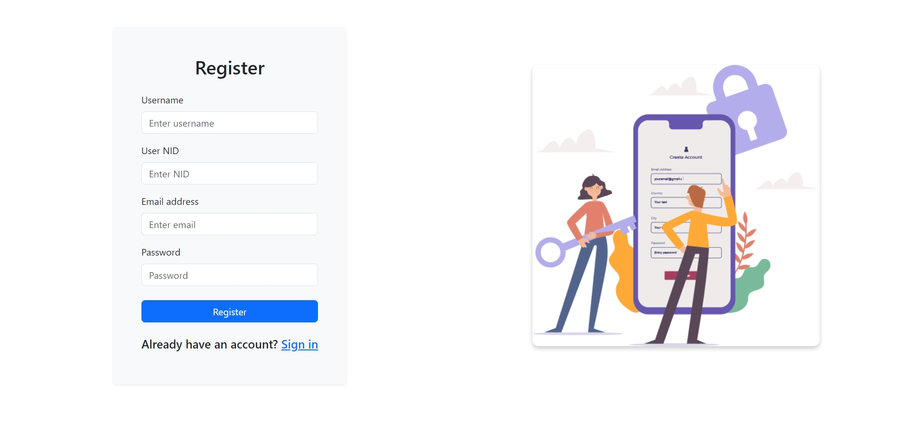

# VaxConnect Bangladesh

**VaxConnect Bangladesh** is a front-end web application designed to provide information on vaccines and diseases, facilitate vaccine registration, and support users in managing their vaccination status. This project aims to enhance public health awareness and streamline the vaccination process in Bangladesh.

---

## Features

- **Home Page**: Offers general information about vaccines and diseases.
  

- **Login**:
  

- **Registration**: 
  

- **Disease and Vaccine Information**: Provides detailed information on various diseases and recommended vaccines.
  

- **Vaccine Registration**: Allows users to register for vaccines, choose preferred hospitals, and submit their application.
  

- **Registration Status**: Users can check their vaccine registration status and track doses.
  

- **Certification and Card Maker**: Generates vaccination certificates and cards.
  

- **Notifications**: Displays updates and important information.
  

- **Chatbot**: Provides real-time assistance and answers to user queries.
  

---

## Usage

- **Home Page**: Explore general information about vaccines and diseases.

- **Disease and Vaccine Information**: View detailed information and images related to various diseases and vaccines.

- **Vaccine Registration**: Fill out the registration form to apply for vaccines.

- **Registration Status**: Check the status of your vaccine registration and track doses.

- **Certification and Card Maker**: Generate and download vaccination certificates and cards.

- **Notifications**: Stay updated with the latest information and announcements.

- **Chatbot**: Interact with the chatbot for assistance and queries.

---

## Technologies Used

- **React.js**: For building the user interface and managing application state.

- **React-Bootstrap**: For responsive and modern UI components.

- **React Icons**: For incorporating icons into the application.

- **Bootstrap**: For styling and responsive design.

- **JavaScript ES6+**: For modern JavaScript features.

---

## Contact

If you have any questions or feedback, feel free to reach out:

- **Email**: joypal.hazard@gmail.com

- **LinkedIn**: [https://www.linkedin.com/in/joy-pal-hazard/](https://www.linkedin.com/in/joy-pal-hazard/)

- **Portfolio**: [https://joypal-hazard-2418.web.app/](https://joypal-hazard-2418.web.app/)
